<h1 align="center">
  just-chart
</h1>

  Create and publish charts and dashboards from the command line in seconds

  <a href="#introduction">Introduction</a> •
  <a href="#install">Install</a>  •
  <a href="#features">Features</a>  •
  <a href="#chart-types">Chart types</a>  •
  <a href="#using-makefiles">Using makefiles</a>

## Introduction

  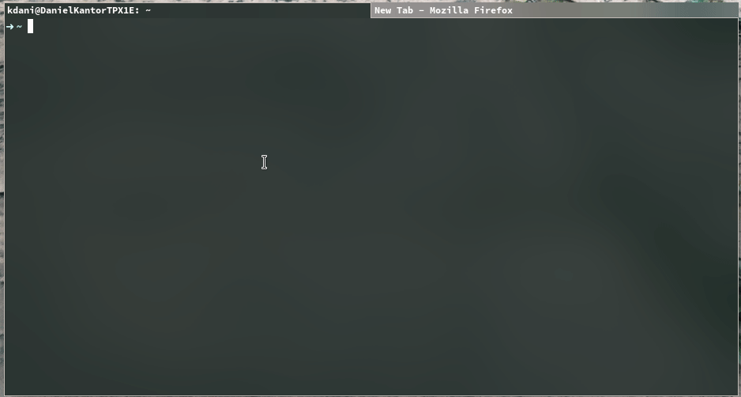

## Features

* use any input format supported by emuto-cli
* save charts to YAML files that can be opened using just-dashboard-desktop
* preview charts using `--show`
* generate a shareable URL for your chart/dashboard in a second using `--publish`

### Upcoming features

* combine multiple charts into a page/dashboard
* more features for making interactive visualizations
* use different backends/platforms for visualizations

## Chart types

### areaChart
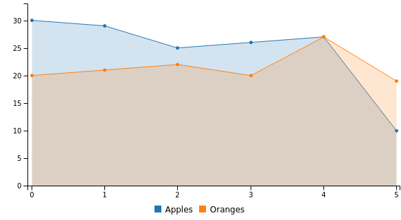

### barChart
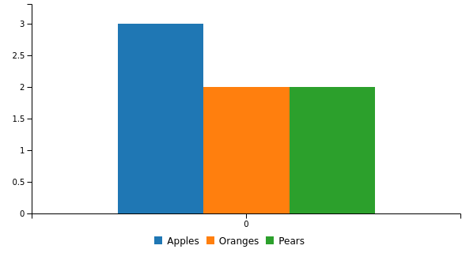

### donutChart
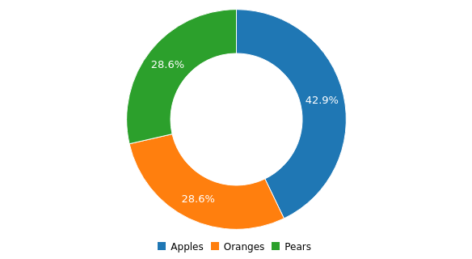

### barChart --horizontal
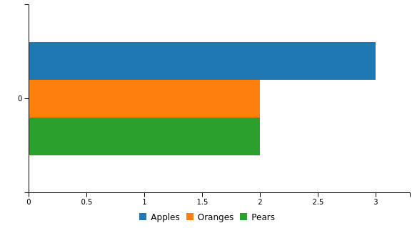

### barChart --horizontal --stacked
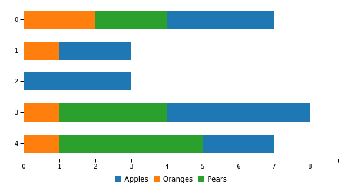

### lineChart
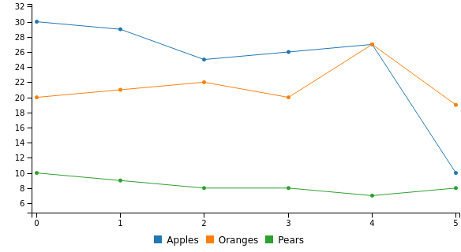

### pieChart
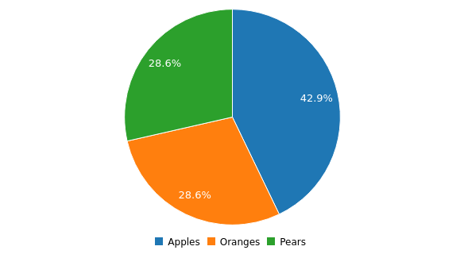

### scatterPlot
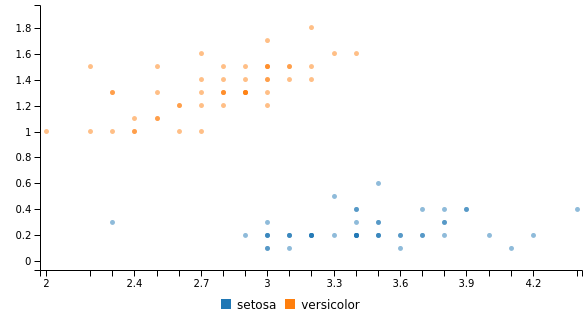

### splineChart
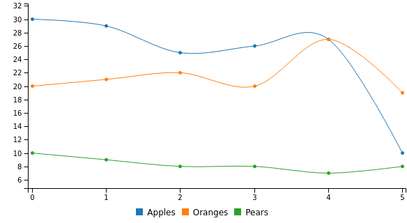

### areaChart --stacked
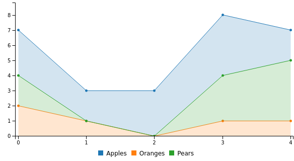

### barChart --stacked
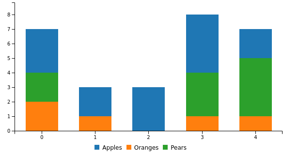

### lineChart --stacked
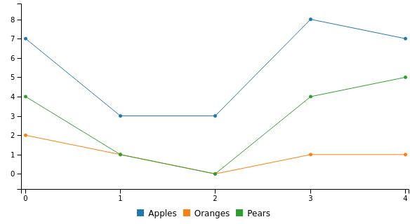

### splineChart --stacked
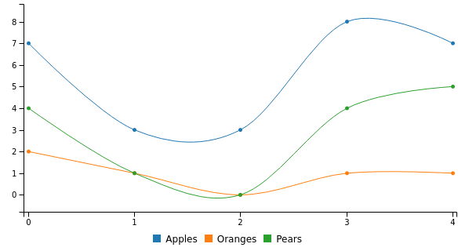

## Using makefiles

FIXME: add documentation here 🙂
